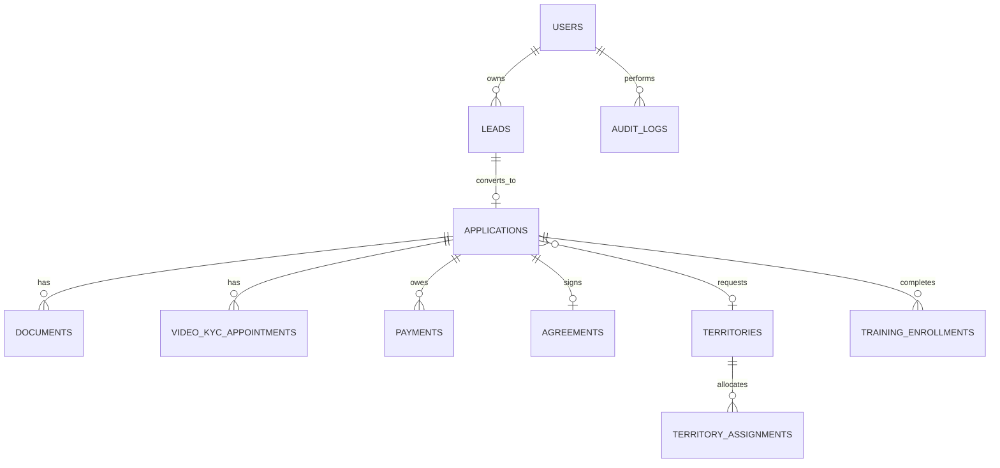

# Initial data model

All exposed entities use UUID public identifiers, timestamps and soft deletes where appropriate. Payments, territory assignments and agreement transitions are transactionally locked and audited.
